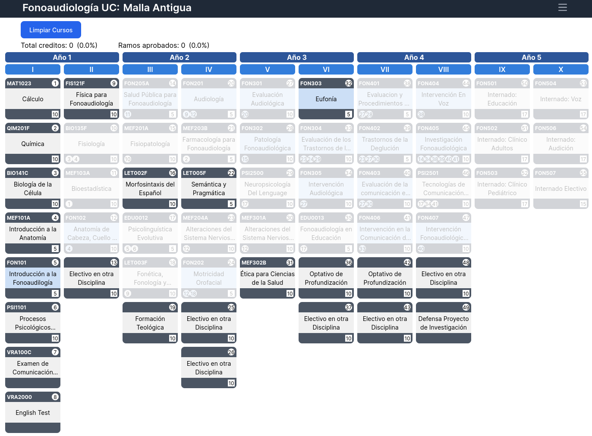

# Interactive University Curriculum

<div align="center">
  <p align="center">
    <a href="https://malla-interactiva-fono.netlify.app/" target="_blank">Demo</a>
    ·
    <!--  
    <a href="#" target="_blank">Video</a>
    · -->
    <a href="https://github.com/loretito/malla-interactiva-uc" target="_blank">Code</a>
  </p>
</div>


<details>
  <summary>Table of Contents</summary>
  <ol>
    <li>
      <a href="#about-the-project">About The Project</a>
      <ul>
        <li><a href="#built-with">Built With</a></li>
      </ul>
    </li>
    <li>
        <a href="#installation">Installation</a>
    </li>
    <li><a href="#roadmap">Roadmap</a></li>
    <li><a href="#acknowledgments">Acknowledgments</a></li>
    <li><a href="#contact">Contact</a>
        <ul>
        <li><a href="#support-me">Support Me</a></li>
      </ul>
    </li>

  </ol>
</details>

## About The Project



This is an app that has an interactive university curriculum for the degree in speech-language pathology (fonoaudiología) at UC

### Built With

Frameworks/libraries used in this project


* [React](https://react.dev/)
* [Vite](https://vitejs.dev/)
* [Tailwindcss](https://tailwindcss.com/)


## Installation

Install my project with npm

1. Clone the repo
```bash
https://github.com/loretito/malla-interactiva-uc.git
```

2. Install packages
```bash
yarn 
```

3. Run 
```bash
yarn dev
```


## Acknowledgements

* [FlowBite](https://flowbite.com/)
* [TablerIcons](https://tablericons.com/)


## Contact

Loreto Ñancucheo - [@loretonancucheo](https://twitter.com/loretonancucheo) - loreto.nancucheo@gmail.com

### Support Me

[Buy me a coffe](https://www.buymeacoffee.com/loretonancucheo) 


Thanks :heart:
